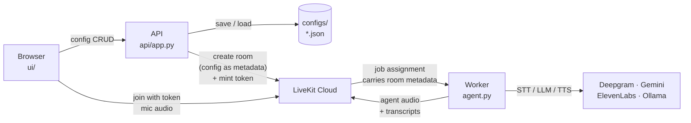

# Conversational AI — a config-driven voice agent

A voice agent whose entire behaviour lives in a JSON document: which speech-to-text,
LLM and text-to-speech providers to use, what the system prompt says, and which tools
it may call. You edit that document in a browser, press **Run**, and talk to the agent
on the same page.

Changing providers or the prompt and starting another call needs **no restart** — the
config travels to the agent worker as LiveKit room metadata, and the voice pipeline is
built fresh for every call.

```
┌──────────┬────────────────────────┬──────────────────┐
│ Configs  │  Settings              │  Talk            │
│          │                        │                  │
│ sample   │  Speech to text  ▾     │  Run Mute Hangup │
│ gemini   │  Language model  ▾     │  ─────────────── │
│ ollama   │  Text to speech  ▾     │  You:   hello    │
│          │  Prompt          ▭     │  Agent: hi there │
│ [New]    │  [Save config]         │                  │
└──────────┴────────────────────────┴──────────────────┘
```

---

## Quick start

**Prerequisites**

| Tool | Install | Needed for |
|---|---|---|
| [uv](https://docs.astral.sh/uv/) | `curl -LsSf https://astral.sh/uv/install.sh \| sh` | everything |
| LiveKit CLI | `brew install livekit-cli` | running the agent worker |
| Ollama *(optional)* | `brew install ollama && ollama serve` | only for configs using a local LLM |

**Set up**

```bash
uv sync
cp .env.example .env      # then fill in your keys
```

**Run** — two terminals:

```bash
make ui        # http://localhost:8000 — config editor + call panel
make worker    # connects to LiveKit Cloud and waits for rooms
```

Open <http://localhost:8000>, pick a config from the sidebar (or build one and save it),
press **Run**, allow microphone access, and talk.

**Or skip the browser** and talk to a saved config straight from the terminal:

```bash
make configs                                     # list saved config ids
make agent CONFIG=sample-agent-20260809-132143   # voice
make agent-text CONFIG=sample-agent-20260809-132143   # typed, no mic, no STT/TTS spend
```

---

## Architecture

Two processes, which never talk to each other directly.



The **API** is the control plane: it validates and stores configs and creates a LiveKit
room with the chosen config stamped on it as metadata, but it never touches audio. The
**worker** is the data plane: LiveKit hands it a job, it reads the config off the room,
builds that call's pipeline, and does the listening and speaking.

### Layers

Dependencies point one way. `config/` imports nothing from the rest of the project; the
API and the worker compose the lower layers and never each other.

```
src/voice_agent/
├── config/          the core — no HTTP, no LiveKit, no audio
│   ├── providers.py   catalogue: every provider, its fields, its credential
│   ├── schema.py      AgentConfig dataclasses + parse_config(), the only validator
│   ├── store.py       JSON files in configs/, newest first
│   ├── errors.py      FieldError(loc, msg) — all errors, not just the first
│   └── env.py         credentials; "supported" vs "available"
├── pipeline.py      provider registry: name -> builder(StageConfig)
├── tools/           LLM function tools, looked up by name from the config
├── agent.py         the LiveKit worker; builds a pipeline per session
└── api/             FastAPI: /api/providers, /api/configs, /api/sessions
ui/                  plain HTML/CSS/JS, served by FastAPI — no build step
configs/             saved agent profiles
```

---

## The config document

```json
{
  "version": 1,
  "id": "sample-agent-20260809-132143",
  "name": "sample-agent",
  "created_at": "2026-08-09T07:51:43Z",
  "stt": { "provider": "deepgram",   "model": "nova-3", "language": "en" },
  "llm": { "provider": "google",     "model": "gemini-3.5-flash-lite", "temperature": 0.7 },
  "tts": { "provider": "elevenlabs", "voice_id": "21m00Tcm4TlvDq8ikWAM",
           "model": "eleven_flash_v2_5" },
  "vad": { "provider": "silero" },
  "prompt": {
    "instructions": "You are a friendly voice assistant...",
    "greeting": "Hi, I'm your voice assistant. What would you like to talk about?"
  },
  "tools": []
}
```

Saved as `configs/<name>-<YYYYMMDD>-<HHMMSS>.json`, and that filename is also the id.
Every save writes a new file rather than overwriting, so prompt revisions keep a history.

**API keys never appear in a config.** The document travels over HTTP to the browser and
gets written onto a LiveKit room; credentials stay in `.env`.

### Supported providers

| Stage | Providers |
|---|---|
| Speech to text | Deepgram (`nova-3`, `nova-2`) |
| LLM | Google Gemini (4 models), Ollama (any local model) |
| Text to speech | ElevenLabs, Deepgram Aura (10 voices) |
| Voice activity | Silero (local, no key) |

A provider is *supported* when a builder exists for it, and *available* when its API key
is present. The UI shows unavailable providers greyed out with the variable they need,
rather than hiding them.

---

## Adding a provider

Two edits, neither of which touches existing provider code — and no UI changes at all,
because the browser builds its form from the catalogue over HTTP.

**1.** An entry in `src/voice_agent/config/providers.py`:

```python
"cartesia": ProviderSpec(
    name="cartesia", label="Cartesia", credential="CARTESIA_API_KEY",
    fields={
        "voice": FieldSpec(type=str, required=True),
        "model": FieldSpec(type=str, default="sonic-2"),
    },
),
```

**2.** A builder in `src/voice_agent/pipeline.py`, registered under the same name:

```python
@register_tts("cartesia")
def _cartesia_tts(cfg: StageConfig) -> TTS:
    return lk_cartesia.TTS(voice=cfg.options["voice"], model=cfg.options["model"])
```

A test asserts the catalogue and the registry stay in step, so adding one without the
other fails the suite rather than a live call.

---

## Design decisions

**A single provider catalogue.** `config/providers.py` is one table describing every
provider — fields, types, defaults, allowed values, and the environment variable that
unlocks it. Four separate concerns read it: the validator, the browser's form, the
credential gate, and the pipeline builders. They cannot disagree about what a provider
is, because there is only one description of one.

**A registry, not an `if/elif` chain.** Builders register themselves by name, so a new
provider never requires editing a function that other providers share.

**The pipeline is built per session, not at import.** No module-level provider globals
anywhere. One worker process can serve every config, which is what makes "edit the
config, press Run again" work without a restart.

**One validator.** `parse_config()` is the only path from a raw dict to an
`AgentConfig`. FastAPI ships with pydantic, but request bodies are read as raw JSON and
handed to that same function, so there is one set of rules rather than two that can
drift. Errors are collected as `(loc, msg)` pairs — deliberately pydantic's shape — and
returned all at once, so the form highlights every bad field in a single pass.

**The prompt lives in the config.** Not in a separate YAML file referenced by a path
that breaks whenever the working directory changes.

---

## Development

```bash
make check      # lock check, format check, lint, mypy --strict
make test       # pytest
make fmt        # apply formatting and autofixes
```

95 tests. Two of them are structural rather than behavioural: one asserts every
catalogue provider has a builder (and the reverse), and one asserts LiveKit plugins are
imported at module level — they must be, because plugin registration refuses to run off
the main thread and builders execute in the job runner thread.

---

## Not built yet

- **Call logs and latency.** Nothing about a call is persisted. The intended shape is
  per-turn metrics from LiveKit's `MetricsCollectedEvent` — end-of-utterance delay, LLM
  time-to-first-token, TTS time-to-first-byte — because per-turn is what tells you
  *which* provider is slow.
- **One command instead of two.** `make ui` and `make worker` still run separately.
- **Auth.** Anyone who can reach `:8000` can create rooms that spend provider credits.
  Fine on localhost, not fine deployed.
- `ConfigStore.list()` silently skips configs that no longer validate, so tightening a
  field's allowed values makes older configs disappear from the sidebar rather than show
  as broken.
