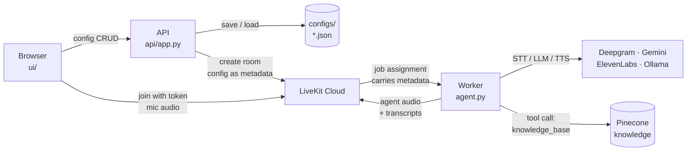
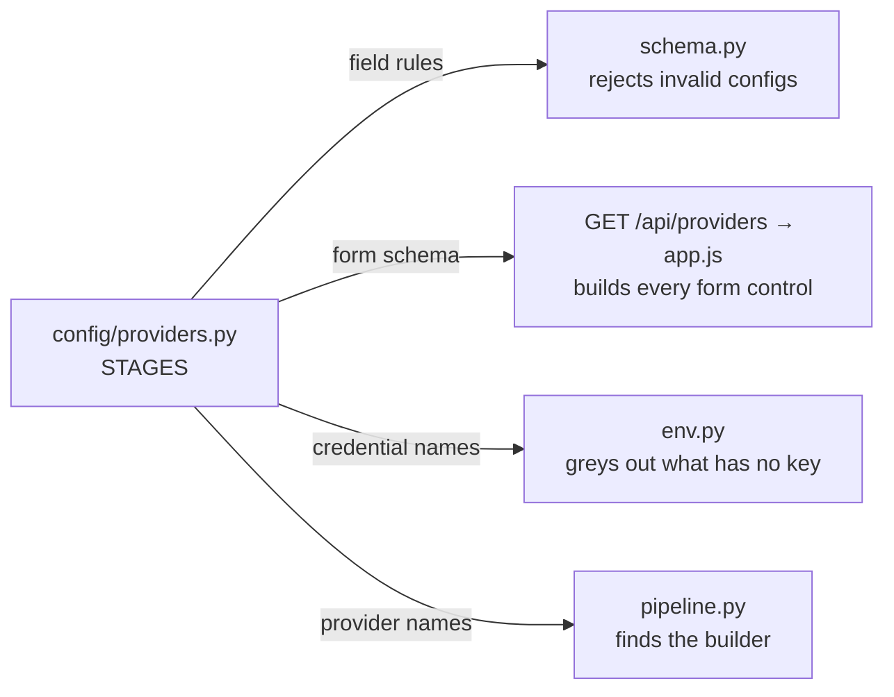
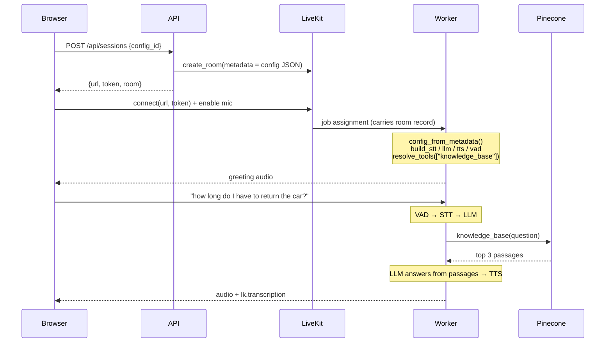

# Architecture

A file-by-file walkthrough: what each part does, how a click becomes a voice, and
why the design is shaped this way. The [README](../README.md) is the front door —
this is the deep dive.

**Scale:** ~3,000 lines of source across 50 tracked files, 123 tests.

---

## 1. The big picture

Two processes. They never talk to each other directly.

| Process | Command | Role |
|---|---|---|
| **API** | `make ui` | Control plane. Validates and stores configs, creates LiveKit rooms. Never touches audio. |
| **Worker** | `make worker` | Data plane. Receives a job from LiveKit, builds a pipeline, listens and speaks. |

LiveKit Cloud is the switchboard between them: the API writes the config onto a
room, LiveKit hands that room to the worker. That indirection is why you can edit
a config and press Run again without restarting anything.



---

## 2. The one idea

`config/providers.py` is a plain Python table describing every provider — its
fields, their types, defaults, allowed values, and the environment variable that
unlocks it. **Four separate concerns read that same table** and therefore cannot
disagree about what a provider is.



One entry, in full:

```python
"elevenlabs": ProviderSpec(
    name="elevenlabs",
    label="ElevenLabs",              # what the dropdown shows
    credential="ELEVEN_API_KEY",     # None means no key needed
    fields={
        "voice_id": FieldSpec(type=str, default=DEFAULT_ELEVENLABS_VOICE),
        "model": FieldSpec(
            type=str,
            default="eleven_flash_v2_5",
            choices=("eleven_flash_v2_5", "eleven_turbo_v2_5"),  # => renders a <select>
        ),
    },
),
```

`choices` present → dropdown. Absent → text box. `type=float` → number input.
`required=True` → the validator rejects a config without it. None of that logic
lives in the JavaScript; the browser just reads these facts over HTTP.

---

## 3. The config document

```json
{
  "version": 1,
  "id": "spinny-support-20260811-083427",
  "name": "spinny-support",
  "created_at": "2026-08-11T03:04:27Z",
  "stt": { "provider": "deepgram", "model": "nova-3", "language": "en" },
  "llm": { "provider": "google", "model": "gemini-3.5-flash-lite", "temperature": 0.3 },
  "tts": { "provider": "elevenlabs", "voice_id": "21m00Tcm4TlvDq8ikWAM",
           "model": "eleven_flash_v2_5" },
  "vad": { "provider": "silero" },
  "prompt": { "instructions": "...", "greeting": "..." },
  "tools": ["knowledge_base"]
}
```

Four deliberate choices:

- **The prompt lives here**, not in a separate YAML file behind a path that breaks
  when the working directory changes.
- **No API keys, ever.** This document goes over HTTP to the browser and onto a
  LiveKit room. Keys stay in `.env`.
- **Each stage carries only its own provider's fields.** Put a `voice_id` under
  `llm` and validation rejects it by name.
- **Every save writes a new file.** Prompt revisions keep a history.

---

## 4. The layers

Dependencies point one way. This is the actual architecture — it is why the UI
could be added without touching the agent, and the tool without touching the API.

```
config/  ←  pipeline.py, tools/, rag/  ←  agent.py
   ↖________________________________________  api/  ←  ui/
```

### Layer 1 — `config/` (the core, ~750 lines)

No HTTP, no LiveKit, no audio. Imports nothing else in the project.

| File | Lines | What it does |
|---|---:|---|
| `providers.py` | 234 | The catalogue. `FieldSpec`, `ProviderSpec`, the four stage dicts, `STAGES`, and `describe_stages()` which flattens it all to JSON for the browser. |
| `errors.py` | 35 | `FieldError(loc, msg)` and `ConfigValidationError` carrying a *list* of them. The `loc` tuple deliberately matches pydantic's shape. |
| `schema.py` | 292 | `AgentConfig` / `StageConfig` / `PromptConfig` dataclasses plus `parse_config()` — the only path from raw dict to validated object. |
| `store.py` | 114 | `ConfigStore.save/load/load_file/list` over `configs/*.json`. |
| `env.py` | 84 | Credentials. Separates *supported* (code exists) from *available* (key present). |

**`parse_config()` in order:** reject non-dicts → check `version` → require a
non-empty `name` → allow `id`/`created_at` to be absent (the store stamps them) →
parse each of the four stages → parse prompt and tools → flag unknown top-level
keys → raise with *every* error, or build the frozen object.

**`_parse_stage()`** is where the catalogue is consulted. For each field the
provider declares:

```python
value = data.pop(fname)

# A cleared form field arrives as "". Treat it as "not supplied": fall back to
# the default, or complain if required. Without this an empty string sails
# through and fails later at the provider's API.
if isinstance(value, str) and not value.strip():
    ...
if not _matches_type(value, fspec.type):
    ...  # wrong type
if fspec.choices is not None and value not in fspec.choices:
    ...  # not allowed
options[fname] = _coerce(value, fspec.type)  # int -> float where needed
```

Leftover keys become "unknown field" errors — that is how a typo (`modle`) or a
field belonging to a different provider gets caught.

Two helpers matter more than they look. `_matches_type()` rejects booleans where a
number is expected, because in Python `bool` subclasses `int` and `True` would
otherwise pass as a temperature. `_coerce()` promotes `int` to `float`.

### Layer 2 — construction and capability

#### `pipeline.py` (182 lines) — the provider registry

Four dicts map a provider name to a builder. No `if/elif` chain anywhere.

```python
@register_tts("elevenlabs")
def _elevenlabs_tts(cfg: StageConfig) -> TTS:
    return lk_elevenlabs.TTS(
        voice_id=str(cfg.options["voice_id"]), model=str(cfg.options["model"])
    )
```

`build_stt/llm/tts/vad` dispatch through `_build()`, which raises
`UnsupportedProviderError` listing what *is* registered. **No module-level
provider globals** — that is what allows one process to serve many configs.

`unregistered_providers()` exists for a test: it reports catalogue entries with no
builder, and a test asserts it is empty (plus a second test for the reverse).

> **All five LiveKit plugins are imported at module level, and must be.** Plugins
> call `Plugin.register_plugin()` at import, which raises *"Plugins must be
> registered on the main thread"* anywhere else — and builders run in the job
> runner thread. Importing lazily inside builders looks tidier and crashes on the
> first session. Two tests pin this down.

#### `tools/` — function tools the LLM can call

| File | Lines | What it does |
|---|---:|---|
| `registry.py` | 45 | `@register_tool(name)` and `resolve_tools(names)`, raising `UnknownToolError` on a typo. |
| `knowledge_base.py` | 92 | Retrieval over whatever is in `knowledge/`. |
| `__init__.py` | 16 | **Imports every tool module** — importing is what registers. |

That last line is a real trap: without the import in `__init__.py`, a config
naming the tool fails with "unknown tool" even though the code exists.

`knowledge_base` is deliberately generic. Nothing about cars or any one company is
in its code; the domain lives in the documents and in the config's prompt. Three
things it must get right to be usable in a voice call:

- **A relevance floor.** Vector search always returns nearest neighbours, even for
  nonsense. Measured on the sample document: on-topic top hits score 0.20–0.51,
  off-topic 0.03–0.09. Anything below **0.15** is dropped and the tool tells the
  model to say it does not know. A confidently wrong policy is worse heard than
  read — the caller cannot skim and check.
- **`asyncio.to_thread`.** The Pinecone SDK is synchronous; calling it inline
  blocks the event loop that is also moving audio frames, heard as a mid-sentence
  stall.
- **Degrade, don't raise.** An exception inside a tool ends the call, so an
  unreachable knowledge base returns a sentence telling the model to offer a
  follow-up.

The docstring is the tool description the LLM sees when deciding whether to call
it, so it is written for the model, not for a developer.

#### `rag/` — documents in, passages out

| File | Lines | What it does |
|---|---:|---|
| `documents.py` | 145 | Read PDF/markdown/text, chunk by section, fall back to size-based chunks. |
| `store.py` | 163 | Pinecone wrapper: `ensure_index`, `upsert`, `search`. |
| `ingest.py` | 69 | `make ingest` — load `knowledge/`, create the index if needed, upsert. |

Chunking keeps the heading **inside** the chunk: it is a strong retrieval signal
and it lets the agent name the section it is quoting. Heading detection is a short
line that does not read like a sentence; a document where that finds nothing falls
back to overlapping size-based chunks, so an arbitrary PDF still ingests.

Embeddings use Pinecone's **integrated inference** — text in, text out, embedded
server-side. One credential, and no chance of the ingest and query paths
disagreeing about embedding dimensions, which fails as silently poor recall rather
than as an error.

Chunk ids are `<document>--<index>--<section>`, so re-running ingest **replaces**
records rather than duplicating them.

### Layer 3 — `agent.py` (172 lines), the worker

`load_dotenv()` runs before any other import, because provider plugins read their
keys from the environment at construction time.

| Function | Does |
|---|---|
| `resolve_config()` | Loads whatever `VOICE_AGENT_CONFIG` names — an id or a path. Every failure exits with a readable message listing what is available. |
| `config_from_metadata()` | Parses the config the API stamped onto the room. |
| `room_metadata(ctx)` | Decides *where* to read that metadata from. |
| `session(ctx)` | The job entrypoint. LiveKit calls it once per call. |

```python
@server.rtc_session()
async def session(ctx: JobContext) -> None:
    config = config_from_metadata(room_metadata(ctx))  # from the room…
    if config is None:
        config = resolve_config()  # …or from the env var

    agent_session = AgentSession(
        stt=build_stt(config.stt),
        llm=build_llm(config.llm),
        tts=build_tts(config.tts),
        vad=build_vad(config.vad),
    )
    await agent_session.start(room=ctx.room, agent=ConfiguredAgent(config))
    if config.prompt.greeting.strip():
        await agent_session.say(config.prompt.greeting)
```

Those four `build_*` calls happen **inside** the handler — a fresh pipeline per
call. That single fact is what makes "edit the config, press Run again, no
restart" work.

> **`ctx.room.metadata` is empty inside the entrypoint.** The room object has not
> connected yet. The room record arrives with the job assignment, so metadata
> lives at `ctx.job.room.metadata`.

`config_from_metadata()` has a deliberate asymmetry: it returns `None` for absent,
non-JSON or foreign metadata so another tool's rooms cannot break the worker, but
**raises** when the metadata is clearly ours and fails validation — starting a call
with a silently wrong agent is worse than failing loudly.

`ConfiguredAgent` is four lines: instructions and resolved tools from the config,
nothing use-case-specific.

`main()` supports two modes. With `VOICE_AGENT_CONFIG` set it resolves and
credential-checks immediately so a typo fails before LiveKit is contacted (that is
`lk agent console`). Unset, config arrives per room (that is `make worker`).

### Layer 4 — `api/` (the control plane)

Does **not** import `pipeline`, `rag` or `agent`. It never builds a voice
component.

`create_app()` is a factory so tests can point it at a temp directory. It loads
`.env`, puts a `ConfigStore` on `app.state`, registers two exception handlers
(`ConfigValidationError` → **422** with every field error, `json.JSONDecodeError`
→ **400** in the same shape), includes three routers under `/api`, then mounts
`ui/` at `/` **last** so `/api/*` wins.

Those handlers are why no route writes error-formatting code.

| Route | Does |
|---|---|
| `GET /api/providers` | The catalogue annotated with `available` per your credentials. Unavailable providers are returned *disabled* with the variable they need, not hidden. |
| `GET /api/configs` | Sidebar summaries — not the whole prompt. |
| `GET /api/configs/{id}` | The full document plus `missing_credentials`. |
| `POST /api/configs` | Validate then save. **201** with the new id. |
| `POST /api/configs/validate` | Validate without saving. |
| `POST /api/sessions` | Create a room carrying the config, mint a scoped token. |

The line the whole architecture rests on:

```python
await lkapi.room.create_room(
    api.CreateRoomRequest(
        name=room_name,
        empty_timeout=EMPTY_ROOM_TIMEOUT_S,
        metadata=json.dumps(config.to_dict()),  # <- the config travels here
    )
)
```

Request bodies are read as raw JSON and handed to `parse_config()`. FastAPI ships
with pydantic, but routing everything through the existing validator keeps one set
of rules rather than two that can drift.

### Layer 5 — `ui/` (the browser)

Plain HTML, CSS and JavaScript served by FastAPI itself. No build step, no second
dev server, no CORS.

- **`index.html`** (99) — three columns: saved configs, settings, call panel. The
  stage cards are *empty divs*; everything inside them is created at runtime.
- **`app.js`** (518) — `renderStages()` and `renderStageFields()` build the entire
  form from `GET /api/providers`. `collectConfig()`/`fillForm()` convert between
  form and JSON. `targetIdFor(loc)` maps a server error path onto a DOM element so
  `["tts","voice_id"]` highlights the right input. `startCall()` posts to
  `/api/sessions`, joins the room, enables the mic; `attachTranscription()` renders
  the `lk.transcription` streams live.
- **`styles.css`** (228) — one grid, `250px / 3fr / 2fr`, with two breakpoints.

The LiveKit browser SDK is vendored in `ui/vendor/`, not loaded from a CDN.

---

## 5. Trace: you press Save

| # | Where | What happens |
|---:|---|---|
| 1 | `app.js · save()` | `collectConfig()` rebuilds the JSON from `data-field` attributes, POSTs to `/api/configs`. |
| 2 | `routes/configs.py` | `await request.json()` — malformed body → 400. |
| 3 | `schema.py · parse_config()` | Validates against the catalogue, collecting every error. |
| 4 | `app.py` handler | On failure: **422**, `{"errors": [{"loc": [...], "msg": "..."}]}`. Nothing written. |
| 5 | `store.py · save()` | Mints `<slug>-<date>-<time>`, suffixes `-2` on collision, stamps UTC, writes. |
| 6 | `routes/configs.py` | **201** with the stored document. |
| 7 | `app.js` | Stores the id, shows "Saved as …", enables **Run**, refreshes the sidebar. |

On a 422, `showErrors()` paints each message under the exact input that caused it
and outlines it red; anything it cannot place goes in the banner, so no error is
silently dropped.

## 6. Trace: you press Run and ask a policy question



The API and the worker never speak to each other. The config crosses between them
by being written onto the room.

---

## 7. Invariants

| Rule | Why it matters |
|---|---|
| **Dependencies point one way** | `config/` knows nothing. Nothing in it may import from `api/`. This is what let the UI, and later the tool, be added without touching the agent. |
| **One choke point** | `parse_config()` is the only path from raw dict to `AgentConfig`. No code downstream inspects raw JSON. |
| **The catalogue is the source of truth** | Provider facts live in one table read by four consumers. |
| **Pipelines are built per session** | Inside `session()`, never at import. No module-level provider globals. |
| **Secrets never enter a config** | Configs travel to browsers and onto rooms. Keys stay in `.env`. |
| **Supported ≠ available** | Code support and credential presence are separate concerns. |
| **Tools are generic; configs are specific** | A tool retrieves from whatever was ingested. The domain lives in documents and prompts. |

### Structural tests

Three of the 123 tests are structural rather than behavioural — they encode
constraints you cannot see by reading the code they protect:

- `test_every_catalogue_provider_has_a_builder` (and the reverse) — the only
  coupling in the design.
- `test_plugins_are_imported_at_module_level` plus a source-level check that no
  builder does a lazy plugin import.
- `test_score_reads_the_documented_key_too` — see the traps below.

| File | Lines | Covers |
|---|---:|---|
| `tests/test_config.py` | 322 | Validation, defaults, blanks, the store, credential gating |
| `tests/test_sessions.py` | 253 | Sessions route with LiveKit stubbed, token grants, metadata resolution |
| `tests/test_rag.py` | 250 | Chunking, response parsing, the tool's thresholds and failure modes |
| `tests/test_api.py` | 209 | Every endpoint, error shapes, static serving |
| `tests/test_pipeline.py` | 157 | Registry dispatch, drift guards, the tool registry |

---

## 8. Traps we hit

Each of these cost real time. The code only looks obvious because of them.

**Plugins must be registered on the main thread.** Importing LiveKit plugins
lazily inside builders — to avoid loading onnxruntime and grpc for unused
providers — crashed every session. Fixed by module-level imports.

**`ctx.room.metadata` is empty in the entrypoint.** Every UI-started call died
with "VOICE_AGENT_CONFIG is not set". The metadata was on `ctx.job.room` the whole
time. The error message was accurate and pointed at completely the wrong cause.

**Empty strings passed validation.** A cleared text box sends `""` and the
validator only checked whether the key was *present*, so `voice_id: ""` was
accepted, written to disk, and failed much later as a provider API error. Blank
strings are now "not supplied".

**Two saves in one second overwrote each other.** Ids have one-second resolution.
Caught by a test; `_unique_id()` now suffixes a counter.

**The score key was `score_`, not `_score`.** Every retrieval hit came back as
`0.000`, so the 0.15 relevance floor would have rejected *everything* — the agent
would have said "I don't have that" to every question while retrieval was working
perfectly. It only surfaced because the scores were printed rather than trusted. A
silent-zero bug that looks like a retrieval failure but is a parsing failure.

**Registration happens at import.** A tool that is never imported is never
registered, and the config fails with "unknown tool" even though the code exists.

**Google lists models it will not serve.** `/v1beta/models` still advertises
`gemini-2.5-flash-lite`, but calling it returns 404 "no longer available to new
users". The list endpoint is not a source of truth; only a real call is.

**A key being set is not a key being valid.** `missing_credentials()` only checks
presence. An expired Deepgram key shows as available then fails as a 401 mid-call,
and ElevenLabs hides its 401 behind "no audio frames were pushed".

---

## 9. Change map

| You want to… | Edit |
|---|---|
| Add a provider | One `ProviderSpec` in `config/providers.py` + one `@register_*` builder in `pipeline.py`. **No UI change.** |
| Offer another model or voice | One tuple in `config/providers.py`. |
| Add a tool | A `@register_tool` + `@function_tool` function, imported in `tools/__init__.py`, named in a config's `tools`. |
| Change what the agent knows | Drop files in `knowledge/`, run `make ingest`. No code change. |
| Add a config field | `AgentConfig` in `schema.py`, its parsing, and wherever it is consumed. |
| Add an HTTP endpoint | A module in `api/routes/`, then `include_router` in `app.py`. |
| Move configs to Postgres | The four method bodies in `ConfigStore`. Callers untouched. |
| Swap the vector store | `rag/store.py`. `documents.py` and the tool are unaffected. |
| Change what the agent says first | The `greeting` field — in the UI, not in code. |
| Adopt pydantic | The body of `schema.py`. Keep `ConfigValidationError.errors` as `(loc, msg)` pairs and nothing else changes. |

---

## 10. Not built yet

- **Call logs and latency.** Nothing about a call is persisted. The intended shape
  is per-turn metrics from LiveKit's `MetricsCollectedEvent` — end-of-utterance
  delay, LLM time-to-first-token, TTS time-to-first-byte. Per-turn is what tells
  you *which* provider is slow.
- **Retrieval latency is unaddressed.** A `knowledge_base` lookup measures ~1.2 s
  from India to Pinecone's `us-east-1`, on top of LLM and TTS time. Options: a
  nearer region, caching frequent questions, or having the agent fill the gap
  while it runs.
- **Per-tool configuration.** `tools` is a list of names; index, `top_k` and the
  relevance floor are constants. The natural extension is objects rather than
  strings.
- **One command instead of two.** `make ui` and `make worker` run separately.
- **Auth.** Anyone who can reach `:8000` can create rooms that spend provider
  credits. Fine on localhost, not deployed.
- **`ConfigStore.list()` silently skips invalid configs**, so tightening a field's
  allowed values makes older configs vanish from the sidebar rather than show as
  broken.
